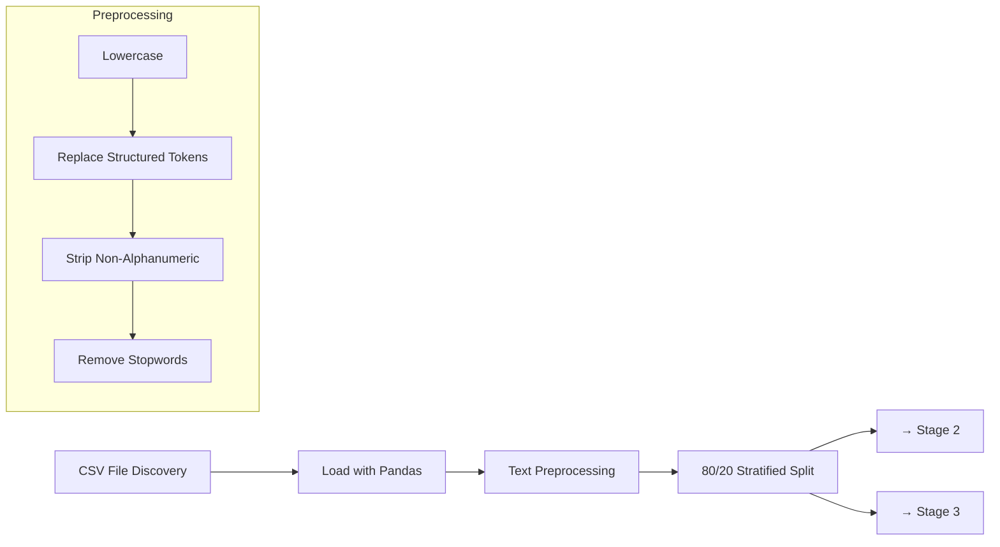
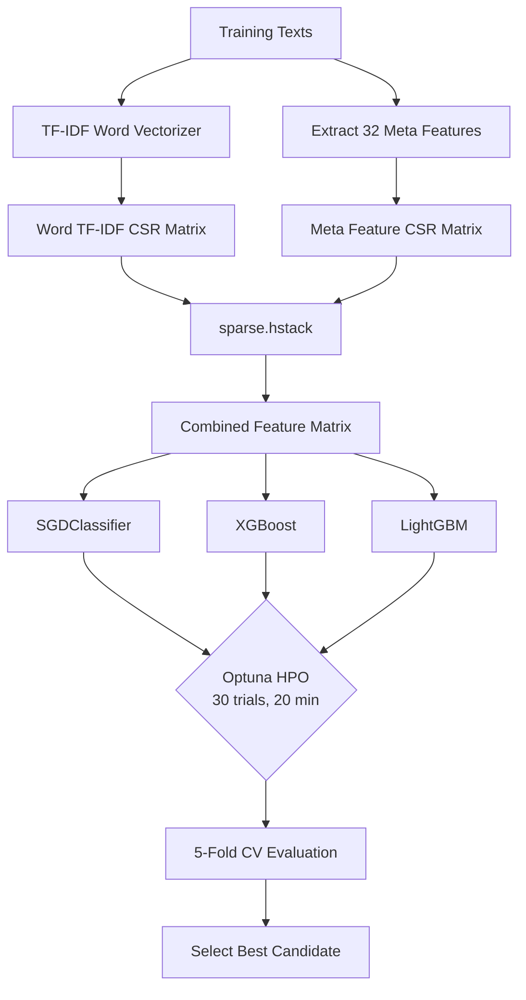
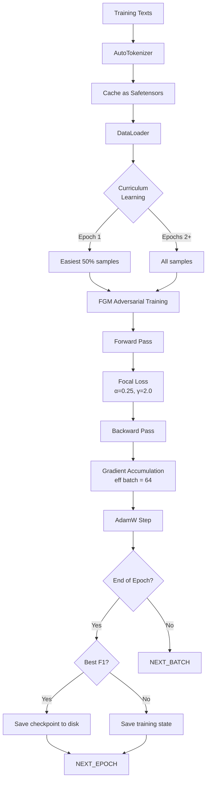
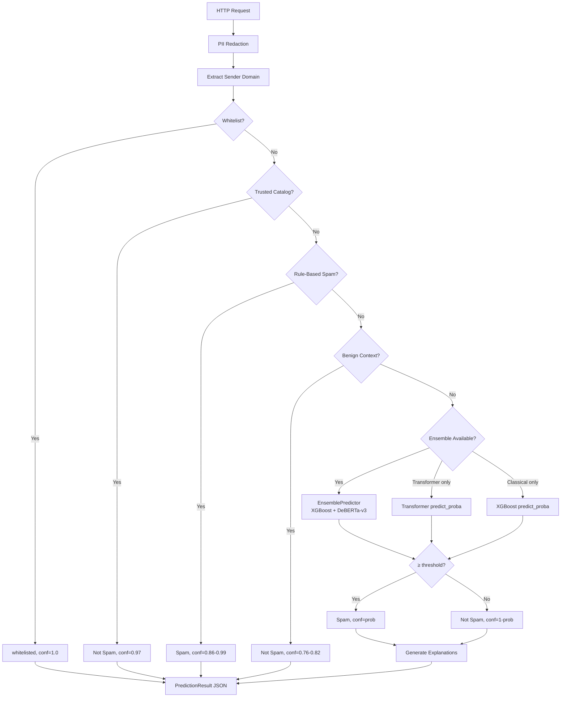

# Model Architecture

This document provides a detailed technical walkthrough of the dual-track training pipeline, inference system, ensemble fusion mechanism, checkpoint management, and artifact generation.

---

## Overview

The system trains two independent models and combines them at inference time through weighted late fusion:

```
┌─────────────────────────────────────────────────────────────────────┐
│                    6-Stage Training Pipeline                         │
│                                                                     │
│  ┌──────────┐   ┌──────────────┐   ┌─────────────────┐             │
│  │ Stage 1  │──▶│   Stage 2    │──▶│    Stage 3      │             │
│  │ Load &   │   │  Track A     │   │   Track B       │             │
│  │ Preproc  │   │  Classical   │   │  Transformer    │             │
│  └──────────┘   └──────┬───────┘   └────────┬────────┘             │
│                        │                    │                       │
│                        ▼                    ▼                       │
│                   ┌─────────────────────────────────┐               │
│                   │         Stage 4                 │               │
│                   │    Ensemble Fusion              │               │
│                   │  Grid Search Fusion Weight      │               │
│                   └────────────┬────────────────────┘               │
│                                │                                    │
│                                ▼                                    │
│                   ┌─────────────────────────────────┐               │
│                   │         Stage 5                 │               │
│                   │    Retrain Winner on 100%       │               │
│                   └────────────┬────────────────────┘               │
│                                │                                    │
│                                ▼                                    │
│                   ┌─────────────────────────────────┐               │
│                   │         Stage 6                 │               │
│                   │    Export Artifacts + SHA-256   │               │
│                   └─────────────────────────────────┘               │
└─────────────────────────────────────────────────────────────────────┘
```

---

## Stage 1: Load & Preprocess



### CSV Discovery

The pipeline auto-discovers the dataset in this order:

1. `--csv-path` CLI argument (explicit path)
2. `KAGGLE_INPUT_DIR` environment variable (Kaggle notebooks)
3. `/kaggle/input/` directory (Kaggle default mount)
4. `data/spam.csv` (project data directory)
5. Current working directory fallback

### Preprocessing Details

| Step | Operation | Preserved | Removed |
|---|---|---|---|
| Lowercase | All text → lowercase | Semantic content | Casing info (caps ratio extracted before) |
| Token replacement | URLs → `urltoken`, emails → `emailtoken`, phones → `phonetoken`, money → `moneytoken` | Structure type | Specific values |
| Strip | Remove non-alphanumeric characters | Letters, digits | Punctuation, symbols |
| Stopwords | Remove common English words | Spam-signal words (free, win, urgent, cash, offer, etc.) | Articles, prepositions, conjunctions |

Spam-signal words are preserved during stopword removal because they carry strong classification signals. A standard stopword list would strip "free" and "urgent" — both critical for spam detection.

### Dataset Split

- **80/20 stratified split** — preserves class balance in both train and test sets
- Split occurs *after* preprocessing but *before* vectorizer fitting — no data leakage
- Test set is held out until final evaluation at Stage 4

---

## Stage 2: Track A — Classical ML



### TF-IDF Vectorization

| Parameter | Default (local) | Competition Mode |
|---|---|---|
| `max_features` | 25,000 | 50,000 |
| `ngram_range` | (1, 2) | (1, 3) |
| `sublinear_tf` | True | True |
| `max_df` | 0.5 | 0.5 |
| `min_df` | 2 | 2 |

Sublinear TF scaling (`1 + log(tf)`) reduces the impact of frequently repeated words in long emails, preventing a single spam keyword from dominating the feature vector.

### Candidate Models

| Model | Strengths | Key Hyperparameters Tuned |
|---|---|---|
| **SGDClassifier** | Fast training, strong linear baseline | `alpha`, `loss` (hinge/log/modified_huber), `penalty` (l1/l2/elasticnet) |
| **XGBoost** | Tree-based, handles non-linear interactions | `n_estimators`, `max_depth`, `learning_rate`, `subsample`, `colsample_bytree`, `min_child_weight`, `gamma`, `reg_alpha`, `reg_lambda` |
| **LightGBM** | Faster training on large data, leaf-wise growth | `n_estimators`, `num_leaves`, `learning_rate`, `subsample`, `colsample_bytree`, `min_child_samples`, `reg_alpha`, `reg_lambda` |

### Optuna Hyperparameter Optimization

- **30 trials** per candidate model
- **20-minute timeout** per candidate (cumulative across trials)
- **5-fold stratified cross-validation** for each trial
- **Objective**: maximize mean spam F1 across folds
- **Pruning**: Median pruner stops unpromising trials early
- **Result**: Best hyperparameters saved and used for final candidate evaluation

### Candidate Selection

The best candidate is selected based on **spam F1 score** on the 20% holdout set. Accuracy and ROC-AUC are also tracked for reporting. The winning model and its vectorizer are passed to the ensemble stage.

---

## Stage 3: Track B — Transformer Fine-Tuning



### Supported Models

| Model | Size | Relative Speed | Best For |
|---|---|---|---|
| **DeBERTa-v3-base** (primary) | 184 MB | 1.0× | Highest phishing detection F1 |
| RoBERTa-base | 125 MB | 1.1× | Strong general baseline |
| ELECTRA-base | 110 MB | 1.3× | Faster training with comparable F1 |
| ModernBERT-base | 130 MB | 1.2× | Modern architecture, long context |
| DistilBERT-base | 67 MB | 2.0× | Fastest, smallest — good for distillation |
| BERT-base-uncased | 110 MB | 1.0× | Widest compatibility |

### Training Techniques

#### Focal Loss

Standard cross-entropy loss treats all misclassifications equally. Focal loss down-weights easy examples and focuses training on hard cases:

```
FL(p) = -α(1-p)^γ · log(p)
```

- **α = 0.25**: Class balancing — reduces the weight of the majority class (ham)
- **γ = 2.0**: Focusing parameter — easy examples (p ≈ 0.9) are down-weighted by (0.1)² = 0.01

This is particularly important for spam detection where the dataset may have mild class imbalance and where obvious spam and obvious ham are uninteresting — the model needs to learn from borderline cases.

#### FGM Adversarial Training (Fast Gradient Method)

Spammers actively try to evade detection. FGM adversarial training adds small perturbations to the embedding layer during training to make the model robust against adversarial text manipulation:

- **ε = 0.5**: Perturbation magnitude
- **α = 0.3**: Step size
- **Applied to**: Token embeddings only (not position or type embeddings)

This means the model learns to classify correctly even when tokens are slightly modified — the same mechanism spammers use (synonym substitution, character swaps, invisible characters) is the attack FGM defends against.

#### Curriculum Learning

Training starts with easier examples and progressively introduces harder ones:

- **Epoch 1**: Easiest 50% of samples (sorted by text length, perplexity, and rule-based confidence)
- **Epochs 2+**: All samples

This helps the model establish a strong baseline before tackling ambiguous cases, reducing training time and improving final convergence.

#### Mixed Precision (FP16)

Automatic mixed precision via `torch.cuda.amp`:
- Forward and backward passes in FP16 (half the memory, 2-3× faster on modern GPUs)
- Weight updates in FP32 (maintains numerical stability)
- Loss scaling to prevent underflow in small gradients

#### Gradient Accumulation

Effective batch size of 64 achieved through gradient accumulation:
- Physical batch size: VRAM-probed (typically 8–12 on T4)
- Accumulation steps: 64 ÷ physical_batch
- Optimizer step after accumulation completes

#### VRAM-Probed Batch Sizing

The training loop dynamically determines the maximum batch size that fits in GPU memory:
1. Start with batch_size=32
2. Run a trial forward+backward pass
3. If OOM, halve batch_size; if successful, try 1.5×
4. Converge to the largest stable batch size
5. Used for the entire training run

---

## Stage 4: Ensemble Fusion

```mermaid
flowchart TD
    CLASSICAL_PROBS[Classical OOF Probabilities] --> GS[Grid Search]
    TRANSFORMER_PROBS[Transformer OOF Probabilities] --> GS

    subgraph GridSearch[Grid Search: w ∈ {0.0, 0.05, ..., 1.0}]
        LOOP[For each w] --> FUSION["p_spam = w·p_classical + (1-w)·p_transformer"]
        FUSION --> COMPUTE[Compute Spam F1 on Holdout]
        COMPUTE --> BEST[Track Best w]
    end

    GS --> OPTIMAL_W[Optimal Fusion Weight]
    OPTIMAL_W --> SAVE[Save Weight to Metadata]
```

### Weighted Late Fusion

The ensemble uses a simple but effective formula:

```
p_spam = w · p_classical + (1-w) · p_transformer
```

Where:
- `w` ∈ [0.0, 1.0] is the fusion weight
- `p_classical` is the spam probability from the Track A winner (typically XGBoost)
- `p_transformer` is the spam probability from the Track B model (typically DeBERTa-v3)
- `p_spam` is the final ensemble spam probability

### Grid Search

The fusion weight is found by grid search on the holdout set:

- **Range**: 0.0 to 1.0 in 21 steps (0.00, 0.05, 0.10, ..., 1.00)
- **Metric**: Spam F1 score
- **Special cases**:
  - `w = 0.0` → transformer-only
  - `w = 1.0` → classical-only
  - `w ≈ 0.5` → equal weighting

### OOF (Out-of-Fold) Predictions

The classical model's OOF predictions come from the 5-fold cross-validation during Optuna optimization. The transformer's OOF predictions are the per-epoch validation probabilities from the holdout set. This means the fusion weight is optimized on data neither model has directly trained on, preventing overfitting.

### Fallback Behavior

If either track fails or is skipped (`--track-a-only`, `--track-b-only`):

- **Classical only**: Defaults to XGBoost without fusion
- **Transformer only**: Defaults to DeBERTa-v3 without fusion
- **Both available**: Full ensemble with grid-searched weight

---

## Stage 5: Retrain Winner on Full Dataset

The winning model (ensemble-best track) is retrained on 100% of the dataset (combining training and holdout sets) to maximize data utilization. This is done *after* evaluation to avoid data leakage into the evaluation.

### Process

1. Combine training and holdout sets
2. If feedback samples exist, merge them (collapsing duplicate entries, mapping labels)
3. Retrain the winning classical model on the combined dataset using the Stage 2 vectorizer
4. The transformer is *not* retrained — it was already trained on all available data (the holdout was only used for OOF probability generation, not backpropagation)

### Feedback Integration

User feedback is loaded from the configured backend (JSONL or MySQL):
- Labels are mapped: "Spam" → 1, "Not Spam" → 0
- Duplicate predictions are collapsed (if user submitted multiple labels for the same prediction, the most recent label takes precedence)
- Feedback samples are appended to the training set before retraining

---

## Stage 6: Export Artifacts + SHA-256

### Artifacts Generated

| Artifact | Format | Purpose |
|---|---|---|
| `spam_model.pkl` | Pickle | Trained XGBoost (or classical) model |
| `vectorizer.pkl` | Pickle | TF-IDF vectorizer + meta feature config |
| `hf_model/` | HuggingFace model directory | Full DeBERTa-v3 model (config + safetensors + tokenizer) |
| `model_metadata.json` | JSON | Training config, metrics, timestamps |
| `*.sha256` | Text | SHA-256 integrity hashes for all pickle/safetensors files |

### HF-Native Model Directory

The transformer is exported as a complete Hugging Face model directory:

```
model/hf_model/
├── config.json               # DeBERTa-v3-base config, num_labels=2, id2label
├── model.safetensors         # Full fine-tuned weights (fp16, ~352 MB)
├── tokenizer.json            # SentencePiece tokenizer (128K vocab)
├── tokenizer_config.json     # Tokenizer class, special tokens, max_length=512
└── special_tokens_map.json   # Special token mappings (optional, embedded in tokenizer_config)
```

This replaces the previous state_dict-based deployment:
- ~ `transformer_model.pt` (bare state_dict)
- ~ `transformer_tokenizer/` (separate directory)

The new format loads directly via `AutoModelForSequenceClassification.from_pretrained()` — no base model download, no `load_state_dict()` call. Eliminates ~703 MB of wasted cold-start downloads per instance.

### SHA-256 Integrity

Every artifact gets a sidecar `.sha256` file containing the hex-encoded SHA-256 hash:

```
model/
├── spam_model.pkl
├── spam_model.pkl.sha256          # → "a3f8b2c1d4..."
├── vectorizer.pkl
├── vectorizer.pkl.sha256          # → "e5f1a3c7..."
├── hf_model/
│   ├── model.safetensors
│   ├── model.safetensors.sha256   # → "b4d2e9f6..."
│   └── ...
```

At load time, each hash is verified using `hmac.compare_digest` for constant-time comparison. If the computed hash doesn't match the stored hash, a `ModelIntegrityError` is raised — the model is not loaded, and the app crashes (fail-fast principle).

---

## Inference Flow (Production)



### Ensemble Routing Logic

```
if _is_ensemble_model(model):
    → EnsemblePredictor.predict_proba(features, raw_texts)
elif _is_transformer_model(model):
    → Transformer.predict_proba(raw_texts)
else:
    → ClassicalModel.predict_proba(features)  # XGBoost or fallback
```

The detection engine auto-detects which artifacts are loaded and routes accordingly. This means the same code serves all deployment modes — ensemble, transformer-only, classical-only — without configuration changes.

### 32 Meta-Features

| # | Feature | Category | Description |
|---|---|---|---|
| 1 | `url_count` | URL | Number of URLs in the email |
| 2 | `url_unique_domains` | URL | Number of unique domains linked |
| 3 | `url_shortened` | URL | Count of URL shortener domains (bit.ly, t.co, etc.) |
| 4 | `url_ip_address` | URL | Count of URLs using raw IP addresses |
| 5 | `url_suspicious_tld` | URL | Count of URLs with high-risk TLDs (.tk, .ml, .ga, etc.) |
| 6 | `url_to_text_ratio` | URL | Ratio of URL characters to total text |
| 7 | `html_tag_count` | HTML | Count of HTML tags detected |
| 8 | `html_hidden_element` | HTML | Count of CSS-hidden elements (display:none, visibility:hidden) |
| 9 | `html_hidden_size` | HTML | Total character content of hidden elements |
| 10 | `exclamation_count` | Text Quality | Count of `!` characters |
| 11 | `question_count` | Text Quality | Count of `?` characters |
| 12 | `caps_ratio` | Text Quality | Ratio of uppercase letters in full text |
| 13 | `digit_ratio` | Text Quality | Ratio of digit characters |
| 14 | `symbol_ratio` | Text Quality | Ratio of symbol characters |
| 15 | `word_count` | Text Quality | Total word count after preprocessing |
| 16 | `avg_word_length` | Text Quality | Average word length in characters |
| 17 | `flesch_reading_ease` | Text Quality | Flesch reading ease score (lower = more complex) |
| 18 | `type_token_ratio` | Text Quality | Unique words ÷ total words (lexical diversity) |
| 19 | `imperative_verb_ratio` | Text Quality | Ratio of imperative verbs (click, buy, call, etc.) |
| 20 | `homograph_hits` | Obfuscation | Count of homograph attack characters (Cyrillic a, etc.) |
| 21 | `unicode_obfuscation` | Obfuscation | Count of unusual Unicode codepoints |
| 22 | `attachment_indicator` | Attachment | Count of attachment-related phrases |
| 23 | `attachment_extension` | Attachment | Count of risky attachment extensions (.exe, .js, .vbs, etc.) |
| 24 | `credential_harvesting` | Credential | Count of credential-harvesting phrases (verify account, login, password expired) |
| 25 | `spam_phrase_hits` | Keyword | Total matches across all spam phrase categories |
| 26 | `urgency_hits` | Keyword | Urgency keyword matches (immediately, urgent, limited time) |
| 27 | `account_hits` | Keyword | Account/security keyword matches |
| 28 | `call_to_action_hits` | Keyword | CTA keyword matches (click here, sign up, download) |
| 29 | `money_count` | Keyword | Currency amounts detected ($, £, €, ¥, ₹, word-suffix) |
| 30 | `phone_count` | Keyword | Phone numbers detected |
| 31 | `promotional_hits` | Keyword | Promotional keyword matches (discount, sale, offer) |
| 32 | `business_context_hits` | Keyword | Business context keyword matches |

Feature extraction is performed in `app/core/features.py` via `extract_meta_features()`.

---

## Checkpoint System

### Transformer Checkpoints

| File | Format | Saved When | Purpose |
|---|---|---|---|
| `{model}_checkpoint.pt` | Full training state | Every epoch | Resume training from exact point |
| `{model}_best.pt` | state_dict only | New best F1 | Inference without optimizer state |
| `{model}_emergency.pt` | Full training state | SIGTERM/SIGINT | Graceful shutdown recovery |

### Checkpoint Contents

```python
checkpoint = {
    "model_state_dict": model.state_dict(),       # Model weights
    "optimizer_state_dict": optimizer.state_dict(), # AdamW state
    "scheduler_state_dict": scheduler.state_dict(), # LR scheduler
    "scaler_state_dict": scaler.state_dict(),       # FP16 gradient scaler
    "epoch": current_epoch,                         # Training progress
    "best_f1": best_f1,                            # Best metric so far
    "rng_state": torch.get_rng_state(),            # Reproducibility
    "train_time": elapsed_time,                    # Total training time
}
```

### Resume Behavior

When `--resume` is passed or a checkpoint is detected:

1. Load `{model}_checkpoint.pt`
2. Restore model weights, optimizer, scheduler, scaler
3. Restore RNG state for reproducibility
4. Resume from `epoch + 1`
5. Skip curriculum learning (all samples from epoch 2+)

### Token Cache

To avoid re-tokenizing the dataset on reruns, tokenized input IDs and attention masks are cached to disk using safetensors format:

```
model/checkpoints/token_cache/
├── train_input_ids.safetensors
├── train_attention_mask.safetensors
├── val_input_ids.safetensors
├── val_attention_mask.safetensors
```

Cache files include a hash of the tokenizer name and max sequence length in the filename to prevent cross-model cache collisions.
