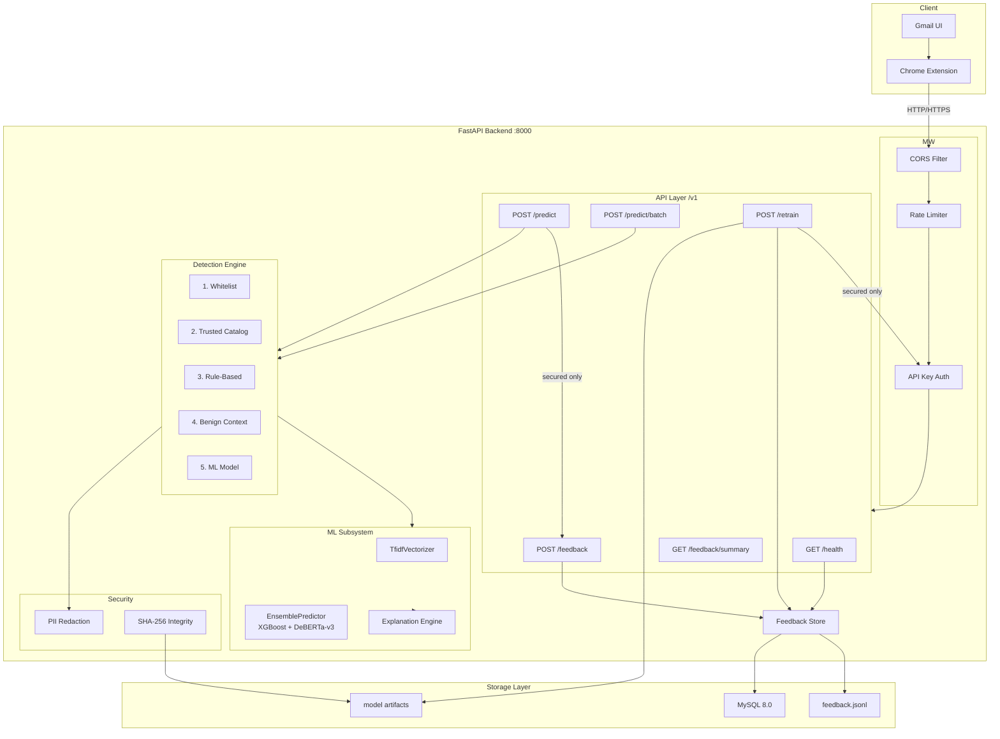
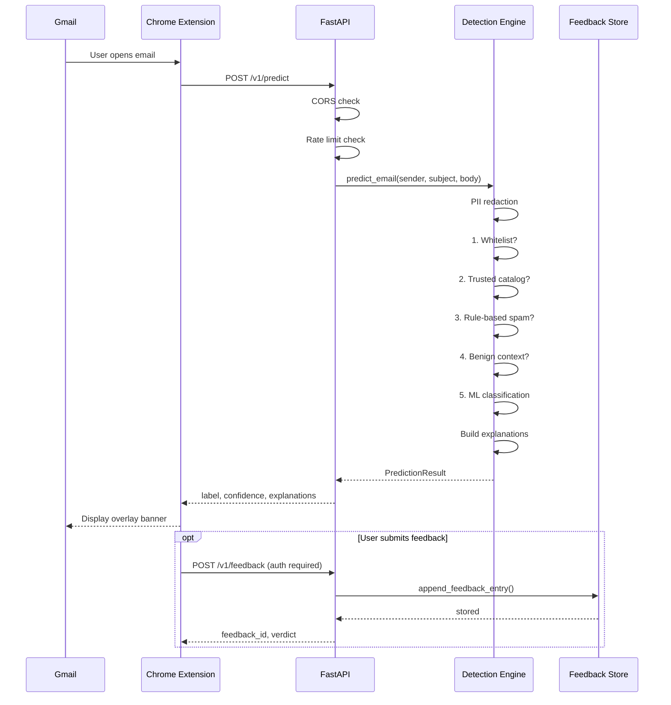
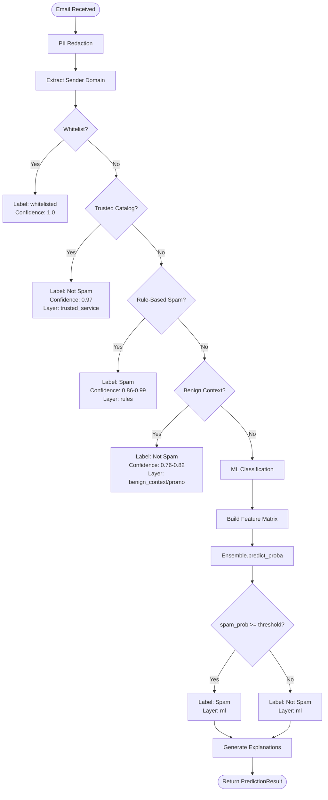
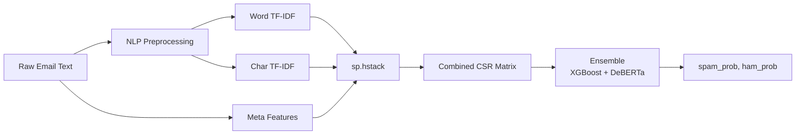
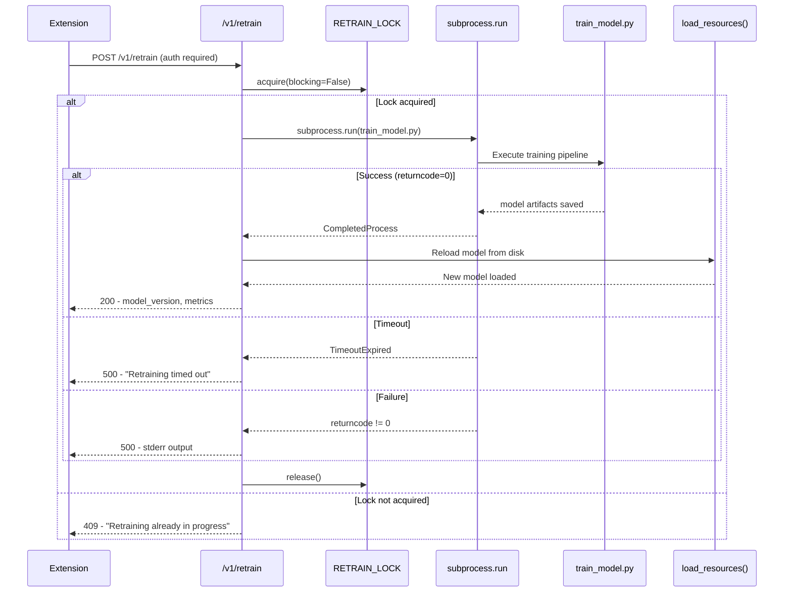
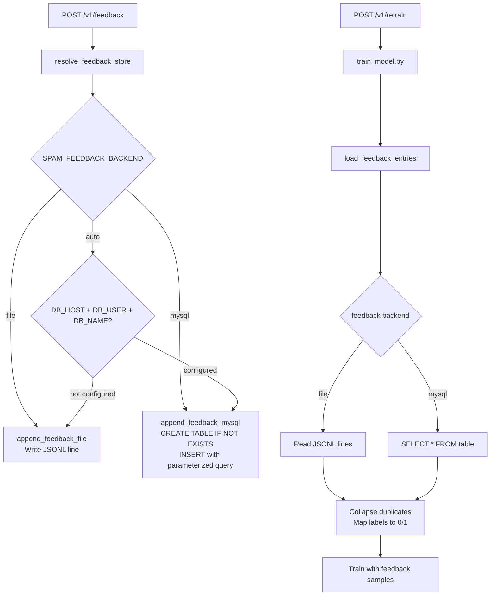
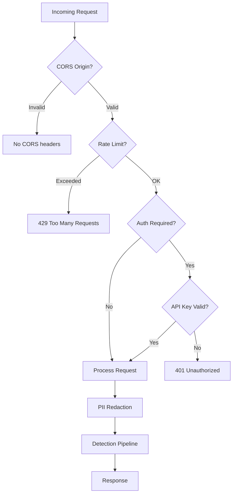
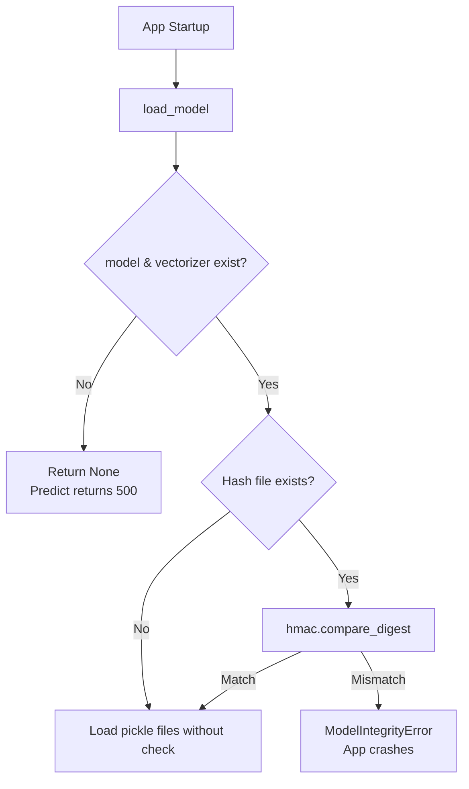
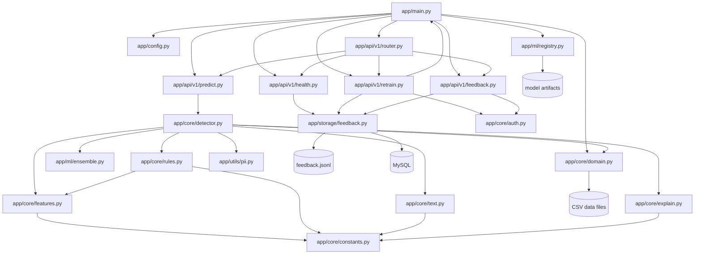

# Architecture

## System Architecture

## Request Flow

## Prediction Flow (5-Layer Pipeline)

### Layer Details

| Layer | Decision Logic | Confidence | Explanation |
|---|---|---|---|
| **Whitelist** | Sender domain in user whitelist CSV | 1.0 | "Trusted sender matched your local whitelist" |
| **Trusted Catalog** | Sender domain in built-in service catalog | 0.97 | "Trusted service domain matched the curated built-in catalog" |
| **Rule-Based** | >=2 spam phrases or >=1 phrase + >=2 signals | 0.86–0.99 | Matched phrases and indicator signals |
| **Benign Context** | Conversational wording, no links/urgency | 0.82 | "Benign-context detection found conversational wording without phishing indicators" |
| **Benign Promo** | Promotional wording, no links, low caps | 0.76 | "Benign promotional detection found retail language without phishing indicators" |
| **ML Model** | Ensemble (XGBoost + DeBERTa-v3) spam probability >= threshold | 0.00–0.99 | Top contributing features from model coefficients |

## Feature Matrix

The ML model operates on a combined feature matrix built from:

### Meta Features (32-dim)

| # | Feature | Description |
|---|---|---|
| 1 | `url_count` | Number of URLs detected |
| 2 | `caps_ratio` | Ratio of uppercase letters |
| 3 | `exclamation_count` | Count of `!` characters |
| 4 | `question_count` | Count of `?` characters |
| 5 | `money_count` | Money amounts (all currencies) detected |
| 6 | `phone_count` | Phone numbers detected |
| 7 | `word_count` | Total word count |
| 8 | `avg_word_length` | Average word length |
| 9 | `digit_ratio` | Ratio of digit characters |
| 10 | `spam_phrase_hits` | Known phishing phrase matches |
| 11 | `urgency_hits` | Urgency keyword matches |
| 12 | `account_hits` | Account/security keyword matches |
| 13 | `call_to_action_hits` | CTA keyword matches |
| 14 | `symbol_ratio` | Ratio of symbol characters |
| 15 | `percent_hits` | Count of `%` characters |
| 16 | `mixed_token_hits` | Mixed letter-number tokens |
| 17–24 | (URL analysis, HTML, obfuscation) | Advanced detection features |
| 25–32 | (Credential, keyword, attachment) | Phishing-specific features |

> Full 32-feature table in [MODEL_ARCHITECTURE.md](../MODEL_ARCHITECTURE.md#32-meta-features).

## Retraining Flow

## Storage Flow

## Security Flow

### Model Integrity on Startup

## Module Dependency Graph

## Key Design Decisions

1. **Module-level model state**: The prediction, health, feedback, and retrain modules hold their state as module-level variables rather than dependency injection. This simplifies the codebase and avoids passing state through every function, at the cost of test isolation complexity (tests patch module state).

2. **CSV for configuration data**: Whitelist and trusted domain catalogs use CSV files rather than a database. This keeps the system self-contained and deployable with zero infrastructure dependencies. CSV files are read once at startup.

3. **JSONL for feedback**: Feedback entries are stored as newline-delimited JSON, making the storage human-readable, version-controllable, and trivially portable. MySQL is offered as an optional upgrade path for multi-instance deployments.

4. **SHA-256 sidecar files**: Model integrity uses hash sidecar files (`model.pkl.sha256`) rather than embedded checksums, allowing hash verification to be retrofitted to existing models and updated independently.

5. **Concurrency lock on retraining**: A `threading.Lock` prevents overlapping retraining jobs. The lock is non-blocking — concurrent requests receive 409 instead of queuing.

6. **PII at the boundary**: PII redaction occurs at the API entry point (`predict_email`) rather than in storage, ensuring redacted data never reaches the feedback store or model training pipeline.
 instead of queuing.

6. **PII at the boundary**: PII redaction occurs at the API entry point (`predict_email`) rather than in storage, ensuring redacted data never reaches the feedback store or model training pipeline.
