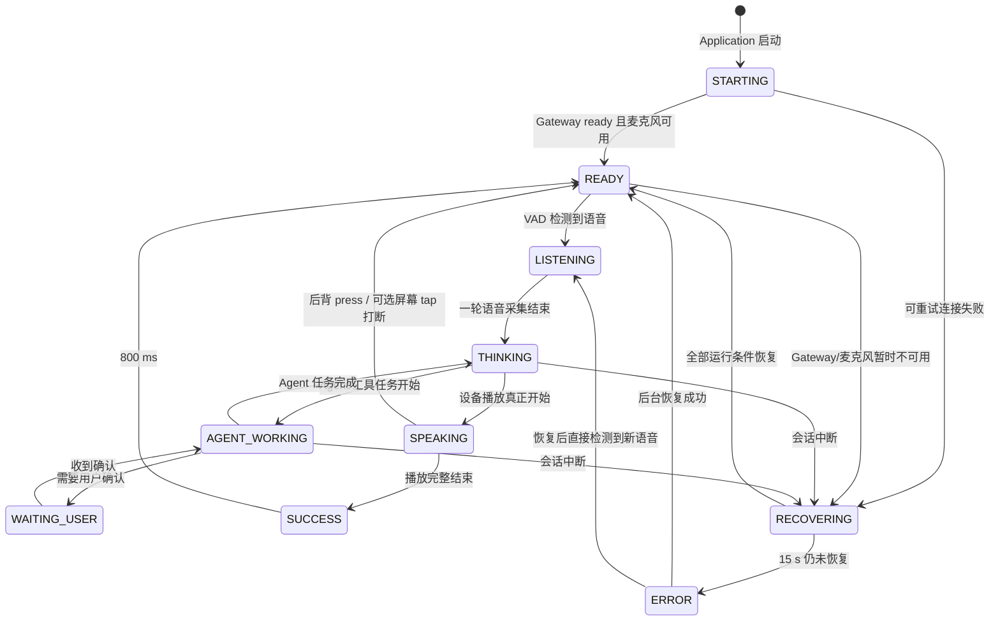

# Application 表情行为状态机

> 状态：已实现。
>
> 固件基线：WatcheRobot ESP32-S3 `v0.3.5`。

## 1. 目标与取消项

机器人只通过固件 `v0.3.5` 已有的标准表情资源表达 Application 状态，
用户不需要安装 App 专用固件，也不需要理解 Daemon、Gateway 等内部组件。

本方案明确取消以下依赖：

- 不使用 `service.status.v1`。
- 不发送 `ctrl.service.status.set`。
- 不依赖机器人屏幕上的 `UPDATE / READY / ERROR` 服务状态页面。
- 不依赖 ESP32 分支中的 NoBuild 烧录工具修改。
- 不增加固件状态、动画、音效或协议。
- 不发送原始 Device 帧；所有控制继续经过 SDK Application Device channel。

最低运行基线保持为标准 ESP32-S3 `v0.3.5`。Application 不发送服务状态心跳，
只保留网页 trace 作为工程诊断面；机器人正面的表情是面向用户的状态反馈。

## 2. 标准资源边界

“标准化行为/表情”定义为：只调用 Python SDK 的公开接口，并且只引用
`v0.3.5` 官方资源目录中的 ID。

长期状态使用 `robot.behavior.play(behavior_id)`，由设备管理 Behavior 生命周期和
UI 资源仲裁。`SUCCESS` 是唯一特例：它使用
`robot.animation.play("happy")`，因为同名 `happy` Behavior 会附带本地
`happy.pcm`，可能在 VAD 恢复后被下一轮录音采集。

不把 `robot.expressions.play_official()` 作为本状态机的主要入口，也不发送原始设备
帧。Behavior 是否带有固件定义的附加动作或音效，以对应固件资源合同为准；当前
Application 只对已确认会污染下一轮录音的 `happy` 结束提示做 Animation 隔离。

### 2.1 渲染策略：稳定的设备 Behavior + 无音效结束动画

`READY` 的逻辑和呈现资源均为固件标准 `awake_idle`。Application 只在状态变化或
Device channel 重建后下发一次，不自行维护概率池，也不按定时器随机切换待机动画。
`STARTING / READY / LISTENING / THINKING / AGENT_WORKING / WAITING_USER /
SPEAKING / RECOVERING / ERROR` 均通过官方 Behavior ID 呈现；设备负责这些长期状态
的动画循环、退出和 surface 仲裁。

## 3. 用户可理解的状态模型

V2 使用九个稳定状态和一个瞬态状态。状态名称描述用户感知，不暴露内部服务名。

| 优先级 | Application 状态 | 用户含义 | 标准资源 | SDK 调用 | 音频安全性 |
| ---: | --- | --- | --- | --- | --- |
| 80 | `ERROR` | 当前不可继续，需要等待恢复 | `error` | `behavior.play("error")` | 固件标准错误 Behavior |
| 70 | `RECOVERING` | 连接或设备能力正在恢复 | `disconnect` | `behavior.play("disconnect")` | 固件标准恢复 Behavior |
| 60 | `SPEAKING` | 机器人正在回答 | `speaking` | `behavior.play("speaking")` | 固件管理播放态呈现 |
| 55 | `LISTENING` | 正在听用户说话 | `listening` | `behavior.play("listening")` | 固件管理监听态呈现 |
| 50 | `WAITING_USER` | Agent 等待用户确认或补充 | `speechless` | `behavior.play("speechless")` | 固件标准等待 Behavior |
| 40 | `AGENT_WORKING` | 正在调用工具或执行任务 | `custom3` | `behavior.play("custom3")` | 固件标准工作 Behavior |
| 30 | `THINKING` | 已听完，正在组织回复 | `thinking` | `behavior.play("thinking")` | 固件管理思考态呈现 |
| 20 | `READY` | 服务正常，正在等待用户 | `awake_idle` | `behavior.play("awake_idle")` | 稳定保持，状态不变时不重复下发 |
| 10 | `STARTING` | Application 正在启动或连接 | `processing` | `behavior.play("processing")` | 固件标准处理 Behavior |
| 瞬态 | `SUCCESS` | 本轮回复完整结束 | `happy` | `animation.play("happy")` | 只播放官方动画，不调用会附带 `happy.pcm` 的同名 Behavior；保持 800 ms 后回 READY |

`RECOVERING` 和 `ERROR` 分离：短暂故障先显示恢复中，超过恢复窗口才显示错误，
避免一次网络抖动就给用户永久错误反馈。

## 4. 主状态流



## 5. 运行条件与状态判定

`READY` 不是单一 Gateway 事件。只有以下条件同时满足才能进入：

1. Application 与 SDK Daemon 的运行上下文有效。
2. Device channel 可用，设备接受 SDK 命令。
3. Qwen Realtime Gateway 已发送 `voice.ready`。
4. Python VAD 已成功打开或恢复麦克风采集。
5. 当前没有未完成的播放、Agent 任务或权限请求。

只收到 `voice.ready`、但麦克风仍返回 `invalid_argument` 时，应保持
`RECOVERING`，不能展示 `READY`。

## 6. 事件到状态映射

| 事件 | 目标状态 | 备注 |
| --- | --- | --- |
| Application session 创建 | `STARTING` | 首次渲染 `processing` |
| `voice.ready` 且 VAD monitoring 成功 | `READY` | 两个条件汇合后才切换 |
| VAD speech start | `LISTENING` | 立即抢占 READY/SUCCESS/ERROR |
| VAD speech end / 上行结束 | `THINKING` | 表示用户已经说完 |
| `response.started` | `THINKING` | 无 Agent 时保持思考态 |
| `task.started/running/progress` | `AGENT_WORKING` | 多个进度事件只首次渲染 |
| `task.permission.requested` | `WAITING_USER` | 与普通执行态明显区分 |
| `task.completed` | `THINKING` | 等待模型形成最终回复 |
| 设备音频播放真正开始 | `SPEAKING` | 不以“收到首个模型 token”为准 |
| 设备确认播放完整结束 | `SUCCESS` | 800 ms 后回 READY |
| PLAYING 时接受显式触摸打断 | `READY` | 立即停止扬声器和前台回复；后台 Agent 继续运行 |
| Gateway 断开、麦克风拒绝或设备命令暂时失败 | `RECOVERING` | 后台继续重试 |
| 恢复超过 15 秒仍失败 | `ERROR` | 保持错误，直到真实恢复 |
| Agent/TTS 本轮失败但基础服务仍可用 | `ERROR` | 1.5 秒后重新检查条件；满足才回 READY |
| Application 停止 | 不主动渲染 | 停止过程不承诺 Device channel 仍可写 |

## 7. 状态优先级与抢占

状态事件可能并发到达，必须由一个串行状态协调器统一裁决，不能由 runtime、VAD、
Agent 和播放器分别直接下发设备命令。

优先级规则：

```text
ERROR > RECOVERING > SPEAKING > LISTENING > WAITING_USER
      > AGENT_WORKING > THINKING > READY > STARTING
```

补充规则：

- `LISTENING` 可以抢占 `SUCCESS` 和本轮非致命 `ERROR`，确保新一轮对话响应及时。
- `SPEAKING` 仅在设备播放实际开始后生效；播放失败转 `ERROR`。
- `READY` 是条件推导状态，低优先级事件不能直接宣称系统 ready。
- `SUCCESS` 只是视觉瞬态，不参与健康判定。
- 同一状态去重，避免重复启动相同循环行为。
- Device channel 重建后增加 `connection_epoch`；即使逻辑状态未变，也要重放一次当前表情。

## 8. 故障和断链的物理边界

Application 只能在 Device channel 可写时改变机器人表情。连接已经完全断开后，
Python 不可能再向机器人发送 `disconnect` 或 `error`；此时设备显示什么由标准固件
自身的连接 UI 和最后画面决定，Application 不伪造“已显示断线状态”。

因此采用以下策略：

- Gateway 断开但 Device channel 仍可用：显示 `RECOVERING/disconnect`。
- 麦克风命令失败但其他设备命令可用：显示 `RECOVERING/disconnect`。
- Device channel 已断：网页 trace 记录离线；不继续假设表情下发成功。
- Device channel 恢复：先重放当前推导状态，再恢复麦克风和会话。
- 表情命令失败是旁路故障，写日志但不主动拆除仍健康的语音会话。

## 9. 实现边界

状态机实现仍归属独立 Python Application：

- `runtime.py` 只发布 Gateway 和 Agent 语义事件。
- `service.py` 只发布 VAD、麦克风和播放语义事件。
- `behavior_system.py` 负责状态推导、优先级、超时、去重和 SDK 渲染。
- `diagnostics.py` 保存工程 trace，但不控制机器人表情。
- Daemon 不解析这些业务状态，也不增加消息类型旁路。

当前实现不包含 `SERVICE_STATUS_HEARTBEAT_SECONDS`、
`_service_status_heartbeat_loop()`、`_publish_service_status()`，也不判断
`service.status.v1` 能力。

ESP32 仓库不为本 Application 提交任何配套改动。开发和发布均以 `v0.3.5`
tag 为兼容基线；`d4e9d5de` 服务状态机和 `e9ee0516` NoBuild 工具提交不属于
Application 发布依赖。

## 10. 验收场景

实现阶段至少覆盖以下自动化和实机路径：

1. 冷启动：`STARTING -> READY`，未成功打开麦克风前不得显示 READY。
2. 普通对话：`READY -> LISTENING -> THINKING -> SPEAKING -> SUCCESS -> READY`。
3. Agent 对话：增加 `AGENT_WORKING`，工具完成后进入 THINKING/SPEAKING。
4. 等待授权：`AGENT_WORKING -> WAITING_USER -> AGENT_WORKING`。
5. Gateway 短断线：先 RECOVERING，15 秒内恢复回 READY，不闪 ERROR。
6. Gateway 长断线：RECOVERING 超过 15 秒进入 ERROR，恢复后才进入 READY。
7. 麦克风 `invalid_argument`：保持 RECOVERING 并重试，不重建健康的模型会话。
8. TTS 播放失败：进入 ERROR，不错误地产生 SUCCESS。
9. 表情命令失败：语音链路继续运行，连接恢复后重放当前状态。
10. 音频安全：回复结束使用 `animation.play("happy")`，下一轮 VAD 不录入
    `happy.pcm`；其余 Behavior 的附加资源按目标固件合同实机验收。
11. 显式打断：仅 SPEAKING/PLAYING 时后背 `press` 生效，设备停止播放并回
    `awake_idle`；非播放状态、release、long_press 和未启用的屏幕 tap 均忽略。
12. Agent 保留：触摸打断 Agent 中间播报时，后台任务继续运行，后续终态仍可到达。

## 11. 已确认的产品决策

当前采用稳定 `awake_idle` 和固件标准 Behavior 状态方案。长期状态统一通过 SDK
Behavior 域下发，保持设备侧生命周期和 UI 仲裁语义；只有回复结束的 `happy`
改走官方 Animation，避免同名 Behavior 的本地音效污染下一轮录音。
