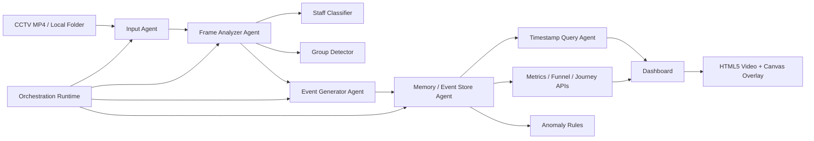

# Agentic Store Intelligence Design

## Architecture



## Agent Responsibilities

- **Input Agent**: validates MP4/local files, extracts video metadata, FPS, duration, timestamp offset, and one-second chunks.
- **Frame Analyzer Agent**: samples video second-by-second, detects people with YOLO when enabled or OpenCV fallback, tracks ids, zones, staff role hints, groups, and per-second dwell.
- **Mirror Suppression Layer**: removes person-like detections that fall inside configured mirror/display polygons before visitor ids, sessions, groups, heatmaps, or funnel events are created. Each suppressed detection is logged with the mirror zone id, bbox, overlap ratio, and video second.
- **Staff Classifier**: explainable heuristic using restricted zones and track persistence; all people are emitted as either `customer` or `staff`.
- **Group Detector**: assigns `group_id` when visitors are close enough in the same timestamp.
- **Event Generator Agent**: emits structured events with `event_id`, `timestamp`, `video_time_sec`, `frame_id`, `visitor_id`, `track_id`, `group_id`, `role`, `event_type`, `zone`, `confidence`, and `metadata`.
- **Memory / Event Store Agent**: stores events, sessions, tracks, dwell, POS, processed videos, and anomalies in SQLite.
- **Metrics Agent**: computes session-based metrics, funnel, zones, visitor timelines, and anomaly lists.
- **Dashboard / Overlay Agent**: renders business KPIs, the timestamp slider, heatmap, funnel, alerts, and a synchronized HTML5 video canvas. Each visible moving customer or staff track receives a stable color outline; staff tracks detected in black-store-dress/service-zone behavior are labeled as employees and drawn with warm orange variants, while customers use distinct cool colors.
- **Orchestration Runtime**: wraps Python agent calls with deterministic safeguards: `max_iterations <= 4`, duplicate tool-call blocking for identical inputs, compact JSON state envelopes, graceful fallback summaries, and terminal checkpoints such as `[STEP 1/6] Agent [InputAgent] initiating tool [inspect_video]`.

## Data Flow

1. Video is uploaded or demo video is generated.
2. Input metadata is extracted and passed to the analyzer.
3. Analyzer emits observations per second.
4. Mirror/reflection detections are filtered before event generation, using store-layout polygons first and geometric reflection-pair checks as fallback.
5. Event generator converts observations into schema-compliant events.
6. Store agent deduplicates events, updates visitor sessions, maps track ids to stable visitor ids, updates dwell/group/reentry state, and creates anomaly records.
7. APIs and dashboard query session-based analytics.
8. The pipeline passes compact JSON-compatible state between agent stages instead of conversational histories.
9. The dashboard synchronizes the video, slider, activity timeline, heatmap, and canvas overlay. The overlay prioritizes high-confidence retail insights, then falls back to a per-second observation so every analyzed second remains explainable without showing raw tracker ids. Mirror/display polygons are drawn as subtle dashed "Mirror / Reflection Area" overlays and never create headcount events.

## Prompt And Execution Constraints

Every system prompt template contains a transparent `CONSTRAINTS` block:

- Do not guess missing information.
- Do not call the same tool with identical inputs more than once.
- If a tool output returns an error or a repetitive answer, report the limitation directly instead of retrying.
- Use compact JSON state between nodes.
- Stop after `max_iterations=4` independent of model stopping behavior and return a graceful summary fallback.
- Cap uploaded-video analysis with `STORE_INTEL_MAX_ANALYSIS_SECONDS` so hosted workers return bounded results instead of running indefinitely.

## Render Deployment Behavior

Video processing is intentionally synchronous for a simple reviewer experience, but it is bounded:

- The browser aborts stalled demo/upload requests and shows `Processing Could Not Complete`.
- The backend processes at most `STORE_INTEL_MAX_ANALYSIS_SECONDS` seconds per uploaded clip by default.
- Terminal stdout includes agent checkpoints for every stage, making Render logs useful for diagnosing slow uploads.
- If an orchestration limit or duplicate tool-call guard is breached, the API returns a compact fallback summary rather than entering a retry loop.

## APIs

- `GET /health`
- `POST /events/ingest`
- `POST /videos/upload`
- `POST /videos/local`
- `POST /demo/run`
- `GET /metrics?store_id=...`
- `GET /funnel?store_id=...`
- `GET /zones?store_id=...`
- `GET /anomalies?store_id=...`
- `GET /visitor/{visitor_id}/timeline?store_id=...`
- Existing store-scoped dashboard APIs remain available under `/stores/{store_id}/...`.

Anomaly responses include `proof` objects with timestamp, rule, measured value, threshold, unit, visitor id, zone, and video/frame references when available.

## Local Reviewer Runtime

The project is designed to run from a fresh clone with Docker:

```bash
docker compose up --build
```

The Docker image includes the FastAPI backend, static dashboard, tests/docs needed for the rubric score, the small bundled demo video, OpenCV runtime libraries, SQLite persistence paths, upload paths, and a `/health` healthcheck. Runtime databases and uploaded videos are stored in Docker volumes rather than committed to the repository.
