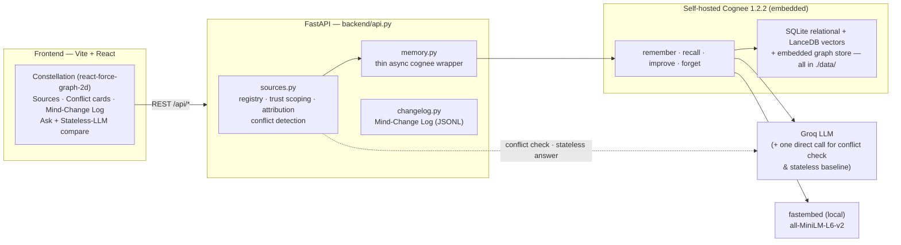

# ✦ ALETHEIA

**_Aletheia — the un-forgetting. An AI research assistant that changes its mind, and you watch it happen._**

Built for the Cognee **"The Hangover Part AI"** hackathon (Best Use of Open Source track), on
**self-hosted open-source [Cognee](https://github.com/topoteretes/cognee)** — no cloud, no
external databases, everything runs on your machine.

This Space runs the **backend API only** (FastAPI + self-hosted Cognee) — there is no
UI here. Point the [Vercel-hosted frontend](https://github.com/Mohammad-umer7/cognee) at
this Space's URL, or see the full repo for screenshots, the demo GIF, and setup instructions.

## The problem / the solution

Every RAG bot can *learn*; almost none can *unlearn*. Real knowledge work is full of
retractions and superseded studies, and an assistant that keeps citing a fraudulent paper
is worse than no assistant at all. Aletheia makes forgetting a first-class, visible,
auditable operation: every source lives in its own Cognee dataset, answers are recalled
only from *trusted* datasets, and retracting a source surgically `forget()`s its memories
while you watch them die in the constellation. When a new source contradicts something
Aletheia trusts, **it notices on its own** and proposes the retraction — the human only
confirms. Every belief change is recorded forever in the Mind-Change Log.

## The 60-second demo

1. **Load demo scenario** — Aletheia reads three fictional sources: a supplement-industry
   trial claiming a 40% memory boost, a news piece amplifying it, and a university
   meta-analysis (~3 min of real knowledge-graph construction; watch the constellation grow).
2. **Ask** *"Does Mnemosyne-7 improve memory? What actually works?"* — the answer parrots
   the 40% claim, citing the trial and the news piece; the contributing nodes pulse.
3. **Flip the compare toggle** — *Aletheia vs Stateless LLM*: the same question answered
   with no memory, side by side. No sources, no receipts, no accountability.
4. **"A retraction notice arrives…"** — one click ingests a journal retraction live.
5. **The amber conflict card slides in** — Aletheia read the notice and *detected by itself*
   that it disputes the trial it trusts, with the reason spelled out.
6. **Click Retract on the card** — a confirm modal warns: *Aletheia will unlearn everything
   derived from this source.* Confirm, and the money shot plays: the source's stars ignite
   red and die while a live ticker counts **"10 memories removed · 20 links severed"**, and
   the Mind-Change Log types in the entry. (Retract the Meridian Post piece too — it only
   repeats the retracted claim.)
7. **Ask the same question again** — the answer now calls the claim retracted and
   unsupported, recommends what actually works (exercise + sleep), and cites the
   meta-analysis instead. Click a citation chip to pulse exactly the memories that answer
   stands on. **The AI visibly changed its mind.**

## Why open source

Aletheia runs 100% on open-source, self-hosted Cognee — no cloud account, no hosted key. All four memory lifecycle operations (remember, recall, improve, forget) execute locally and are verified by automated tests.

## Architecture



**One dataset per source** is the core design move: each source lives in its own Cognee
dataset (`src_<slug>`), so trust scoping is a recall filter and `forget(dataset=...)` is
surgical. A local registry maps sources → trust state → their graph node IDs. The frontend
never talks to Cognee — only to the FastAPI backend.

## Cognee usage map

| Operation | Where | What it does in Aletheia | Why it matters |
| --- | --- | --- | --- |
| `cognee.remember(text, dataset_name=...)` | `backend/memory.py` → `sources.ingest_source` | Ingests each source into its own dataset (`src_<slug>`) | The dataset is the unit of trust — sources can be forgotten independently |
| `cognee.recall(q, datasets=[...], system_prompt=...)` | `memory.py` → `sources.ask` | Answers generated **only** from trusted datasets | Retracted knowledge is structurally out of scope, not merely deleted |
| `cognee.improve(dataset=...)` | `sources.reenrich_remaining` | Re-enriches every surviving dataset after a retraction | The corrected worldview re-settles instead of leaving a hole |
| `cognee.forget(dataset=...)` | `memory.py` → `sources.retract_source` | The retraction itself: surgical deletion of one source's memories | The money shot is a real deletion, measured before/after |
| Node snapshot attribution | `sources.ingest_source` + `sources._ledger_nodes` | Graph-node diff (after − before) cross-checked against cognee's relational node ledger | The UI animates exactly the node IDs that actually died — no fakery |
| `visualize_graph(path, dataset=None)` | `scripts/seed.py` | Cognee's built-in interactive graph HTML at seed time | Debugging the real graph, straight from the engine |

## Measured, not claimed

Fresh `pytest tests/test_flip.py` output (2/2 consecutive green runs, 2026-07-05):

| Metric | Value |
| --- | --- |
| Conflict auto-detected on retraction ingest | yes — `disputed_source_id == "helios_study"`, asserted |
| Nodes removed (Helios trial retraction) | 10 |
| Links severed (Helios trial retraction) | 20 |
| Nodes removed (Meridian Post retraction) | 6 |
| Links severed (Meridian Post retraction) | 11 |
| Answer changed + discredited "40%" gone | 2/2 consecutive runs |
| Full flip-test runtime | 3:10, then 2:46 |

The flip test drives the entire narrative programmatically — seed → ask → ingest
retraction → **assert the conflict was detected** → retract through the same code path as
the UI button → ask again — and asserts the retracted sources are out of recall scope, the
answer changed, and the discredited figure is gone.

## Judging-criteria map

| Criterion | Where this repo shows it |
| --- | --- |
| **Impact** | Unlearning-as-a-feature: retractions, corrections, and superseded studies are everyday failures of RAG assistants — Aletheia makes the fix visible and auditable |
| **Creativity** | The AI proposes its own retractions (conflict cards); memory as a living constellation; a Mind-Change Log; stateless-LLM comparison built in |
| **Technical excellence** | Trust-scoped recall, exact node→source attribution via cognee's graph ledger, measured link severing, retry/backoff on free-tier limits, flip test green twice consecutively |
| **Best use of Cognee** | All four lifecycle ops (`remember`/`recall`/`improve`/`forget`) on self-hosted Cognee, one dataset per source, real `get_graph_data()` driving the UI — see the usage map above |
| **UX** | Glass panels over a force-directed sky; conflict cards; confirm modal + live ticker; guided flight that checks itself off from real app state |
| **Presentation** | This README, the 60-second demo path, and the flip test as a reproducible demo script |

## Setup

Prereqs: Python 3.11+, Node 18+, a free [Groq API key](https://console.groq.com/keys).

```bash
git clone <this repo> aletheia && cd aletheia

# backend
python -m venv .venv
.venv\Scripts\pip install "cognee[groq,fastembed]==1.2.2" fastapi uvicorn python-dotenv pytest httpx
copy .env.example .env        # then paste your Groq key into LLM_API_KEY
$env:PYTHONUTF8="1"; .venv\Scripts\python -m uvicorn backend.api:app --port 8000 --timeout-keep-alive 75

# frontend (second terminal)
cd frontend
npm install
npm run dev                    # → http://localhost:5173
```

(macOS/Linux: `source .venv/bin/activate`, `cp .env.example .env`,
`PYTHONUTF8=1 uvicorn backend.api:app --port 8000 --timeout-keep-alive 75`.)

First run downloads the local embedding model (~100 MB). Cognee's storage (SQLite +
LanceDB + graph store) lives entirely in `./data/` — delete it (or run `scripts/reset.py`)
for a clean slate. Optional: `scripts/seed.py` seeds the demo sources from the CLI instead
of the UI button.

Verify the whole thesis programmatically:

```bash
.venv\Scripts\python -m pytest tests/test_flip.py -s   # the flip test: Aletheia changes its mind
```

## Honesty notes

- All seed sources are fictional; no real brands, journals, or people are referenced.
- Built with AI assistance (Claude Code); all architecture and code reviewed by the team.
- **Nothing is mocked.** Every answer is a live `cognee.recall()`; every node in the
  constellation comes from `get_graph_data()`; every "N memories removed · M links severed"
  is a real before/after diff of the graph.
- Shared entities survive retraction on purpose: if two sources mention Mnemosyne-7,
  retracting one kills only the nodes no surviving source supports.

## License

MIT — see [LICENSE](LICENSE).
