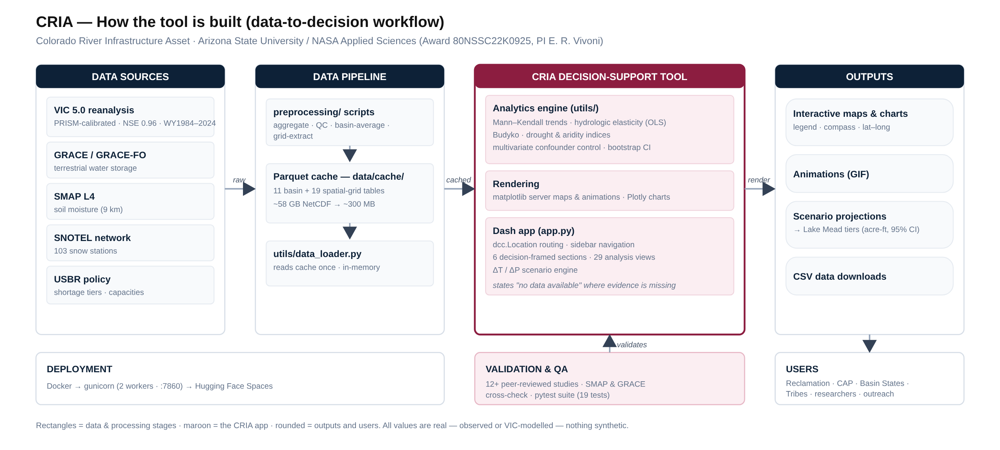

# CRIA — Colorado River Integrated Assessment

**▶ Start here — walkthrough document:** https://praddyk-cria-dst.hf.space/assets/CRIA_Blueprint.html
*(the guided overview — what the tool does, the evidence behind it, and a link straight into every analysis)*

**Live tool:** https://praddyk-cria-dst.hf.space

An interactive decision-support tool for water-resource management in the Colorado River Basin (CRB).
It fuses NASA Earth observations with a calibrated hydrologic reanalysis and presents the results in
the terms water managers actually use — basin by basin, question by question.

*Interactive version (hover to trace the flow, click any stage, run the pipeline): open [`assets/figures/workflow.html`](assets/figures/workflow.html) in a browser.*

### Highlights

- **Fuses NASA GRACE + SMAP** with a PRISM-calibrated **VIC 5.0** reanalysis (streamflow NSE = 0.96).
- **32 analysis views** across 6 decision-framed sections — interactive maps, animations and a live ΔT/ΔP scenario engine.
- **Companion to a published study** (Ghimire, Vivoni & Wang 2026, *Water Resources Research*) on fall soil-moisture controls of streamflow.
- **Reproducible pipeline:** raw ~58 GB NetCDF → ~300 MB Parquet cache → Dockerized on Hugging Face Spaces.
- **Honest & tested:** every value traceable to its source, data gaps stated plainly, backed by an automated `pytest` suite.

**Built with:** Python · Plotly Dash (Flask + Bootstrap) · VIC 5.0 · SNOTEL · GRACE/GRACE-FO · SMAP L4 ·
pandas / scipy / geopandas / xarray · matplotlib · Dockerized on Hugging Face Spaces.

**Project:** *Managing the Colorado River as an Infrastructure Asset: Fusing Remote Sensing and
Numerical Modeling in the Operations of the Central Arizona Project.*
**Affiliation:** Arizona State University, in collaboration with the Central Arizona Project ·
NASA Applied Sciences – Water Resources (Award 80NSSC22K0925, PI Enrique R. Vivoni).

## Decision-framed sections

| Section | What it answers |
|---------|-----------------|
| Overview | The three questions the tool answers, then any analysis |
| Water Supply & Snow | Where the water comes from — snowpack→runoff, water balance, snowmelt timing, elevation, Budyko |
| Drought & Risk | Drought & shortage risk, reservoir tiers, water storage (GRACE), recovery, aridification |
| Scenarios & Future | ΔT / ΔP scenario engine, projections to 2100, CMIP5/CMIP6, seasonal (NMME) forecasts |
| Basin Maps | Side-by-side maps of every variable, SNOTEL stations, rivers, plus seasonal & drought animations |
| Governance & About | Water governance, the CRIA asset framework, methods, and publications |

## Validated hydrologic model

All analyses derive from a PRISM-calibrated VIC 5.0 reanalysis of the CRB (WY1984–2024), calibrated on
snow and streamflow and independently evaluated against NASA SMAP and GRACE:

> Wang, Z., Ghimire, S., Whitney, K. M., Mascaro, G., Xiao, M., Yue, H., & Vivoni, E. R. (2026).
> *Revisiting the application of the Variable Infiltration Capacity (VIC) model in the Colorado River
> Basin using SMAP and GRACE.* **Scientific Reports, 16, 15890.**
> Streamflow NSE = 0.96 (Upper Basin); SMAP soil moisture R² = 0.71 (surface), 0.81 (root-zone);
> GRACE terrestrial water storage R² = 0.66–0.86.

## Data

- **VIC 5.0** — PRISM-calibrated reanalysis, ~6 km (1/16°), WY1984–2024; basin-aggregated parquet cache (deployed)
- **SNOTEL** — 103 CRB-region NRCS stations, peak-SWE annual records and trends
- **GRACE / GRACE-FO** — terrestrial water storage anomalies (2002–present)
- **SMAP L4** — surface and root-zone soil moisture

Raw NetCDF inputs (~58 GB) are processed locally; only the parquet cache (~200–400 MB) is deployed.

## How it's built — end-to-end workflow

The data-to-decision framework is shown in the diagram at the top of this page.

**Pipeline in words:** raw NASA/observational NetCDF is aggregated and quality-checked by the
`preprocessing/` scripts into a compact, version-controlled **Parquet cache**. The app never touches
the raw files — `utils/data_loader.py` reads the cache once (cached in memory), and the analysis
view modules in `modules/` render everything on demand. The whole thing is containerized and served by
gunicorn on Hugging Face Spaces, so the deployed app is fully reproducible from the repository.

## Data inventory

| Dataset | Source | Resolution · period | What it provides |
|---|---|---|---|
| **VIC 5.0 reanalysis** | PRISM-forced, U. Washington model | ~6 km (1/16°) · WY1984–2024 | Runoff, baseflow, ET, SWE, soil moisture, air/surface temp — the analytical backbone |
| **SNOTEL** | NRCS (in-situ) | 103 CRB stations · annual | Peak-SWE records + Mann-Kendall snowpack trends |
| **GRACE / GRACE-FO** | NASA/JPL (satellite gravimetry) | basin · 2002–present | Terrestrial water-storage anomalies (incl. groundwater signal) |
| **SMAP L4** | NASA (satellite) | basin · 2015–present | Surface & root-zone soil moisture (model validation) |
| **Shortage tiers / capacities** | USBR (public policy) | — | Lake Mead tier ladder, reservoir capacities, CAP cuts |

## Technology stack

| Layer | Tools |
|---|---|
| **Hydrologic model** | VIC 5.0 (PRISM-calibrated), validated vs SMAP & GRACE |
| **Data processing** | Python · xarray · netCDF4 · pandas · geopandas · rasterio · pymannkendall · statsmodels |
| **Cache / storage** | Apache Parquet (pyarrow / fastparquet) · Git LFS |
| **Application** | Plotly Dash (Flask + Bootstrap) · modular `layout()` + `register_callbacks()` per view |
| **Visualization** | Plotly · Matplotlib (server-rendered maps & animations) · dash-leaflet |
| **Testing** | pytest — import, every-view-renders, data-sanity, headline-value & map-render checks |
| **Deployment** | Docker · gunicorn (2 workers, :7860) · Hugging Face Spaces |

---

Developed by Pradeepika (Praddy) Kaushik — Geospatial & Data-Visualization Scientist, Arizona State University.

© 2026 Pradeepika (Praddy) Kaushik / Arizona State University. All rights reserved.
This tool and its source code are proprietary. No permission is granted to copy, reuse, redistribute, or
create derivative works without the author's prior written consent.
