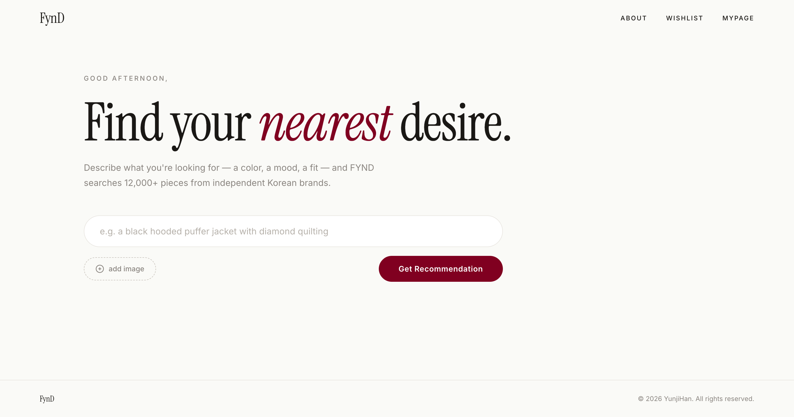
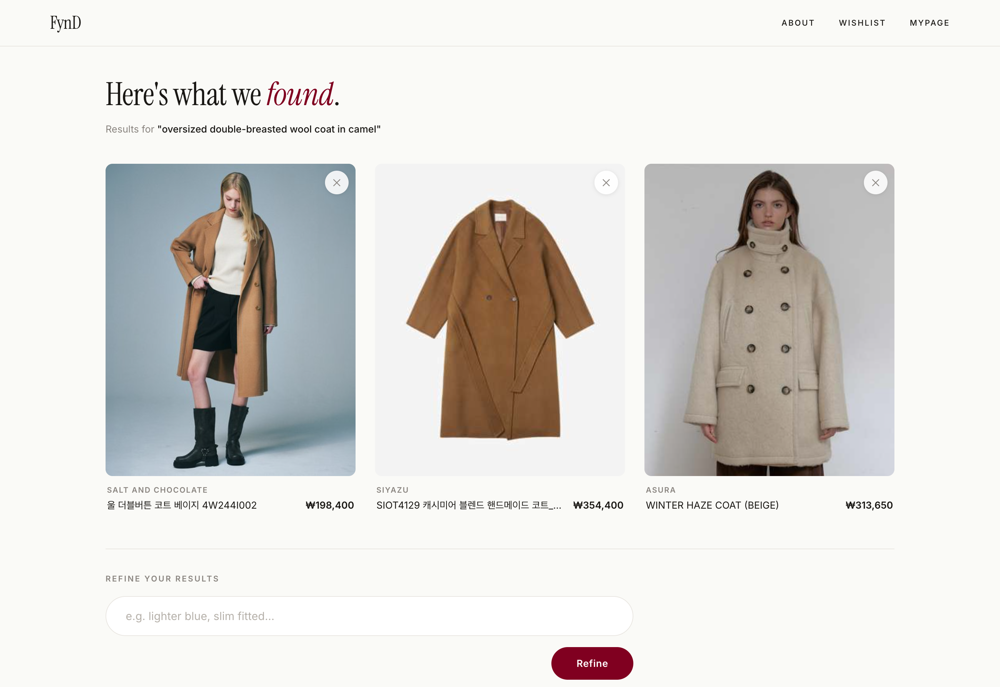
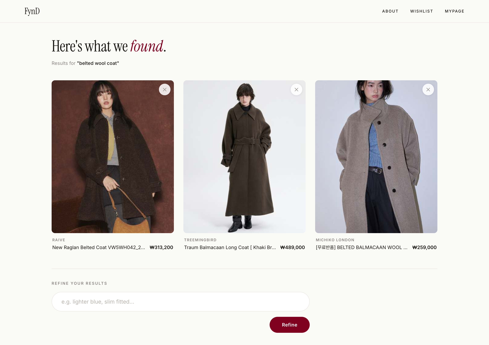
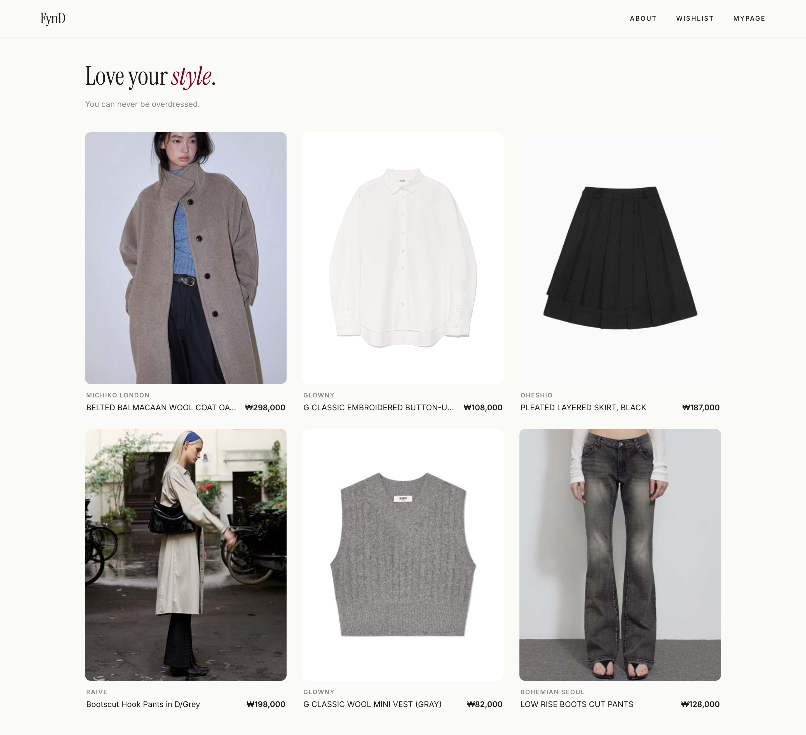
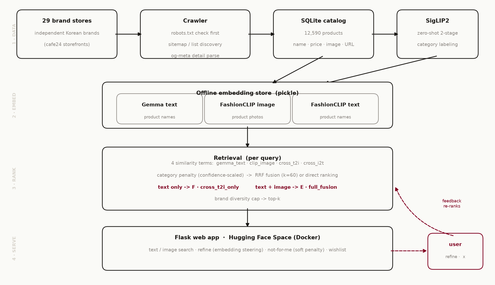
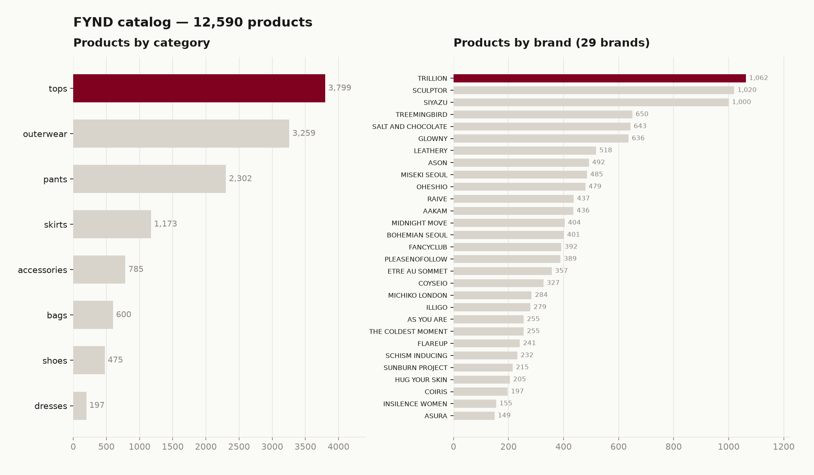
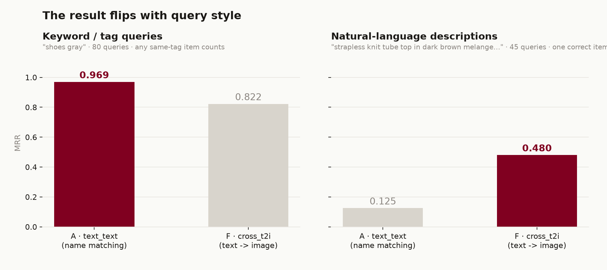

# FYND — find your nearest desire

**Language:** English | [한국어](README-KR.md)

Search independent Korean fashion brands by description, by photo, or both. FYND matches your query against ~12,590 real products using image embeddings instead of product names.

[](https://wiz1112-fynd-demo.hf.space)



<sub>Python 3.11 · Flask · PyTorch · FashionCLIP · SigLIP2 · EmbeddingGemma · SQLite · Docker on Hugging Face Spaces</sub>

---

## Table of contents

- [Overview](#overview)
- [Why FYND](#why-fynd)
- [Features](#features)
- [How it works](#how-it-works)
- [Dataset](#dataset)
- [Choosing the ranking model](#choosing-the-ranking-model)
- [Run it locally](#run-it-locally)
- [Tech stack](#tech-stack)
- [License and credits](#license-and-credits)

---

## Overview

FYND is a cross-modal search engine for independent Korean fashion. Instead of guessing the right keyword, you describe what you want and it finds the closest pieces.

There are three ways to search:

- **Text** — "a black hooded puffer with diamond quilting"
- **Image** — upload a photo and get visually similar pieces
- **Text + image** — anchor on a photo and steer it with words

Every product is indexed as image and text embeddings, and a query is answered by comparing vectors. Ranking never reads product names, which is what makes descriptive search work.

**Live demo: https://wiz1112-fynd-demo.hf.space**

---

## Why FYND

Shopping search is built around tags and category filters, and that falls apart the moment you search by how something actually looks.

- The same words mean different clothes at different brands. One label's "loose fit" is another's oversized silhouette, and a single filter value flattens all of it.
- Product names can't hold the details that matter: fabric, drape, how a pleat falls, how cropped a hem sits. That information lives in the photo, and name-based search throws it away.
- The platforms that aggregate these brands don't search on those details well, so there is a real gap.

Since the useful signal sits in the images, FYND ranks on images.

For the data, the big platforms can't be crawled (their robots.txt disallows it), so I crawled individual brand storefronts directly. I picked Korean domestic brands partly because I like them, and partly because they are exactly the case where these details matter and where existing search comes up short.

---

## Features

**Text, image, or both.** Describe a piece, upload a reference photo, or combine the two. Here "oversized double-breasted wool coat in camel" returns camel coats across three brands, ranked on image similarity alone.



Add a photo and the search blends both signals. "belted wool coat" plus an uploaded coat surfaces belted balmacaan silhouettes, including the exact source piece.



**Refine.** Relative tweaks like "lighter blue" or "a bit more cropped" nudge the results in that direction, without starting a new search.

**Not for me.** Hide a piece you dislike and its visual lookalikes drop out of the results too.

**Wishlist.** Save pieces you want to keep.



The interface is English-first, since the retrieval model expects English queries.

---

## How it works



1. **Crawl.** 29 brand storefronts (all on the Cafe24 platform) are crawled into a SQLite catalog, respecting each site's robots.txt with polite delays. Details come from Open Graph metadata, images are de-duplicated by hash and resized to 500 px.
2. **Classify.** SigLIP2 labels each product's category from its image, in two zero-shot stages (major category, then finer), instead of trusting the inconsistent site menus.
3. **Embed.** FashionCLIP image and text embeddings and EmbeddingGemma name embeddings are precomputed once and cached.
4. **Rank and serve.** FashionCLIP embeds the query into the same space as the product photos. A text-only query ranks directly on text-to-image similarity; a text + image query fuses four signals with Reciprocal Rank Fusion. A per-brand cap keeps the results varied. **Refine** adds the refinement phrase as a steering vector to the query; **not for me** applies a similarity penalty to lookalikes. The whole thing runs as a Flask app on a Docker Space.

---

## Dataset

**12,590 products · 29 independent Korean brands · 8 categories.**



The mix leans toward tops and outerwear, which reflects what these brands actually stock. Categories come from image classification, so they follow how a garment looks rather than whatever its title says.

> [!NOTE]
> This is crawled from real storefronts, so it's a little messy. Around 259 products have a bad price (a parser grabbing the wrong number), and some names are still in Korean. Nothing is hand-cleaned to look nicer than it is.

---

## Choosing the ranking model

The core question was whether to rank on product names or on images. I compared name-based text matching against cross-modal text-to-image ranking, and the answer depends on how people search.



- With **short keyword tags** ("shoes gray"), name matching looks great, because the words are literally in the product names.
- With **full descriptions**, name matching collapses while text-to-image holds up (MRR 0.48 vs 0.12).

Real users describe what they want, they don't type SKU-style tags, so FYND ranks text-only queries with cross-modal text-to-image. When a photo is also provided, it fuses four signals to use both inputs. Stacking heavier fusion on top of the plain cross-modal ranker didn't give a statistically meaningful gain in testing, so the simpler setup is what ships.

---

## Run it locally

Requires Python 3.11. The database and precomputed embeddings are tracked with Git LFS.

```bash
git clone https://huggingface.co/spaces/WIZ1112/fynd-demo
cd fynd-demo

python3.11 -m venv .venv
source .venv/bin/activate
pip install -r requirements.txt

python app.py
# open http://localhost:5001
```

The first query takes a few seconds while the models load, then it's fast. To run it the way it deploys:

```bash
docker build -t fynd .
docker run -p 5001:5001 fynd
```

---

## Tech stack

| Layer | Choice |
|-------|--------|
| Retrieval encoder | FashionCLIP (`patrickjohncyh/fashion-clip`) |
| Name embeddings | EmbeddingGemma (`google/embeddinggemma-300m`) |
| Category classification | SigLIP2 (`google/siglip2-base-patch16-224`) |
| Fusion | Reciprocal Rank Fusion (k=60) |
| Backend | Flask + SQLite |
| Deployment | Docker on Hugging Face Spaces |

---

## License and credits

A university capstone project by **Yunji Han**. The code is MIT licensed. Product data and images belong to their respective brands and were collected under robots.txt-respecting terms for non-commercial research.

© 2026 Yunji Han
