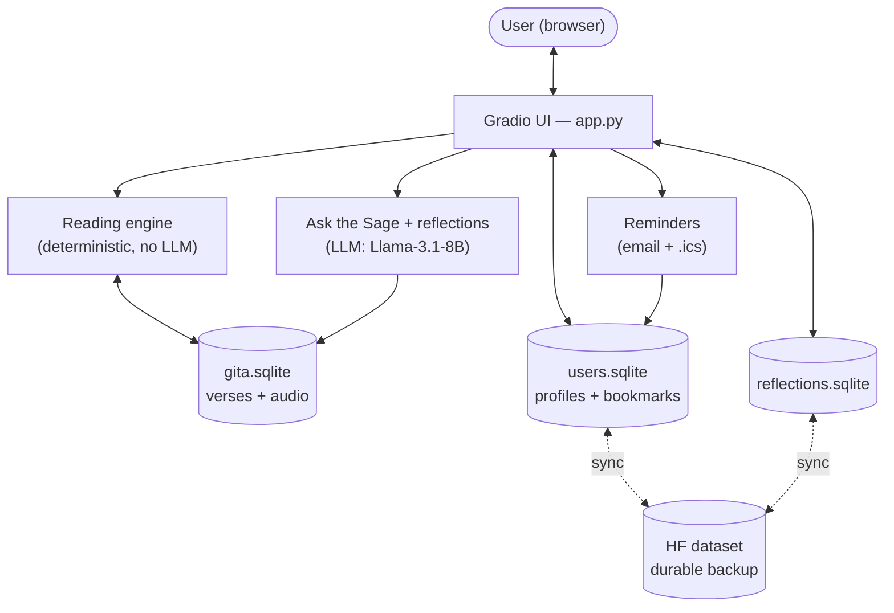
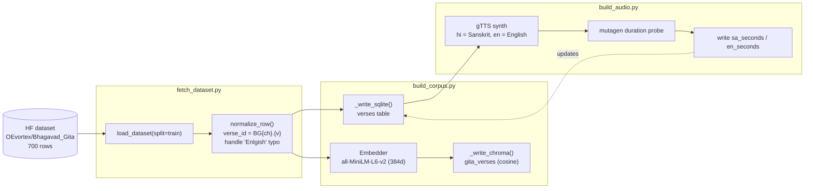
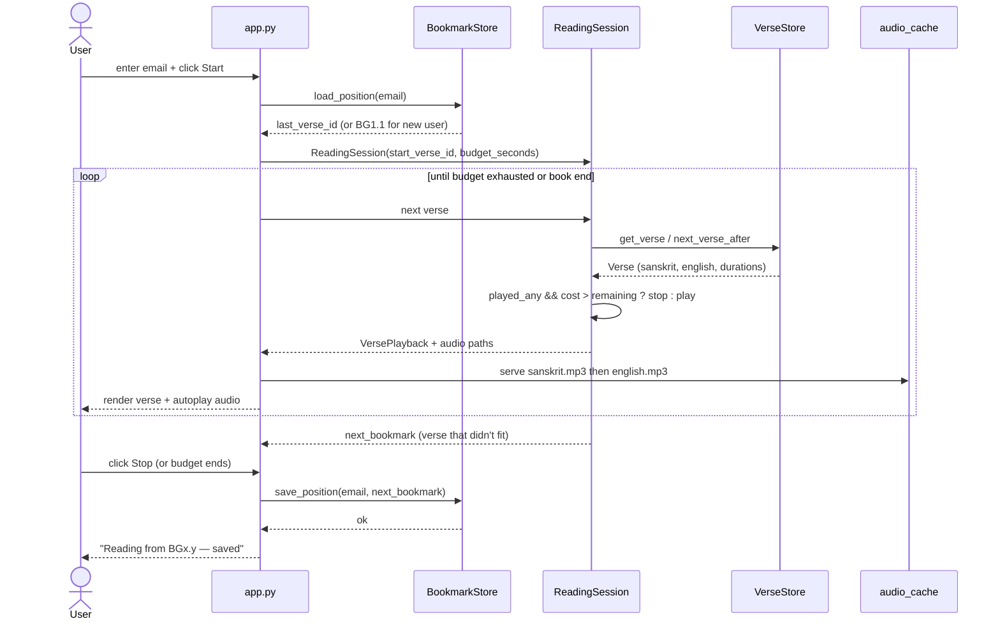
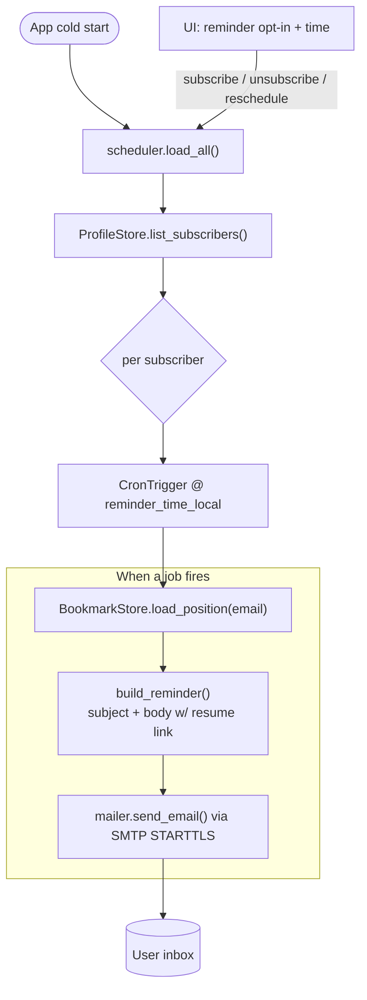
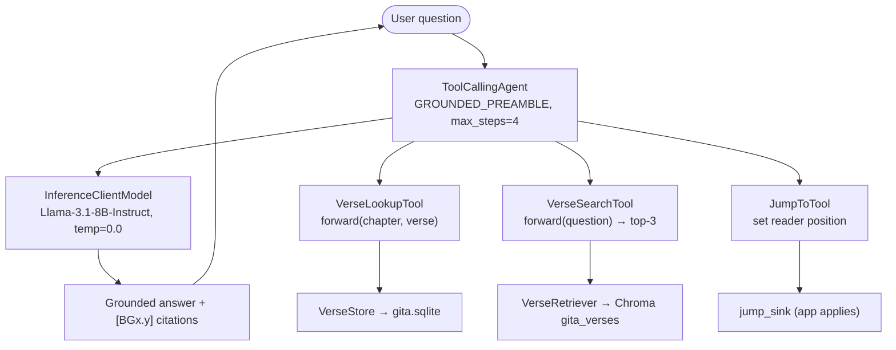
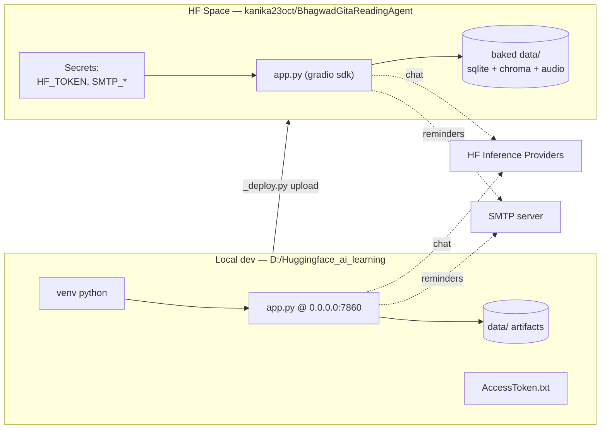

# BhagwadGitaReadingAgent — Architecture

Visual reference for how the app is wired together. See [PLAN.md](PLAN.md) for the
design rationale and decision log.

---

## 1. System overview

High-level components. **Reading is deterministic Python** (no LLM); the **LLM
serves only the chat panel and per-verse reflections**. Verses live in a
read-only `gita.sqlite`; user data and reflections have their own databases,
backed up to a private HF dataset.



---

## 2. Data ingestion pipeline (Phase A)

One-time (idempotent) build that turns the HF dataset into the SQLite corpus,
the Chroma index, and the audio cache. `ensure_corpus()` / `ensure_audio()` run
this lazily on cold start and skip work already done.



---

## 3. Reading session — resume from bookmark (Phase B + D)

The core user loop: identify by email, resume from the saved verse, play verses
until the wall-clock budget is spent, then persist the next bookmark.



---

## 4. Reminder scheduling (Phase C)

Subscribed users get one daily APScheduler job that emails a resume link with
their current bookmark. In-process scheduler is a v1 local-only limitation.



---

## 5. Chat layer — "Ask the Sage" (Phase E)

A grounded Q&A agent. The LLM may only answer from verses returned by the tools;
it cites refs in `[BGx.y]` form and refuses ungrounded questions.



---

## 6. Data model

Single SQLite database `data/gita.sqlite` with three tables; Chroma holds the
parallel vector index keyed by `verse_id`.

```mermaid
erDiagram
    VERSES {
        text verse_id PK "BG{ch}.{v}"
        int chapter
        int verse
        text title
        text sanskrit
        text english
        text hindi
        real sa_seconds
        real en_seconds
    }
    USERS {
        text email PK
        int max_minutes "10-60"
        bool reminder_opt_in
        text reminder_time_local "HH:MM"
        text created_at
        text updated_at
    }
    BOOKMARKS {
        text email PK_FK
        text last_verse_id FK
        text updated_at
    }
    USERS ||--|| BOOKMARKS : "has position"
    VERSES ||--o{ BOOKMARKS : "points at"
```

---

## 7. Deployment topology (Phase F)

Local dev runs everything in-process. The HF Space bakes the prebuilt `data/`
artifacts to avoid cold-start audio synthesis; SMTP and HF tokens are Space secrets.


